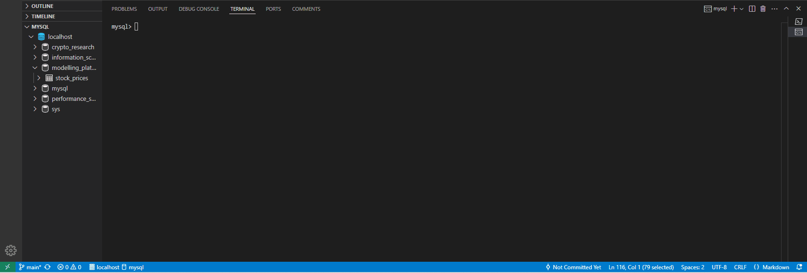
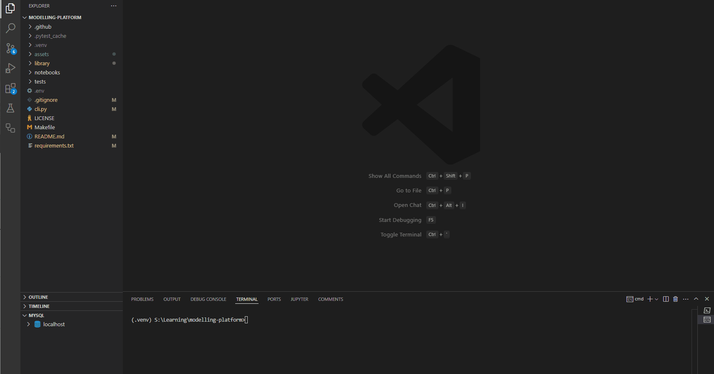
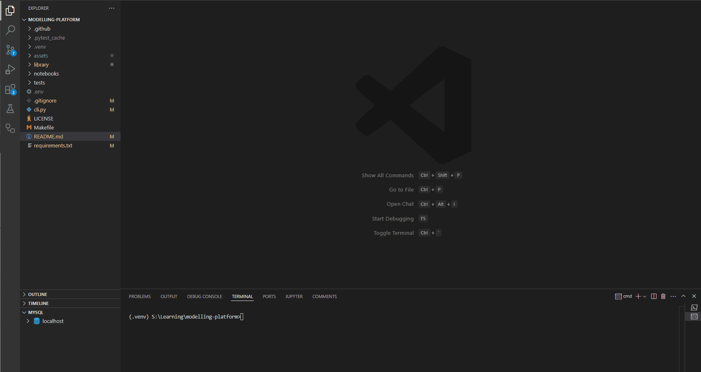
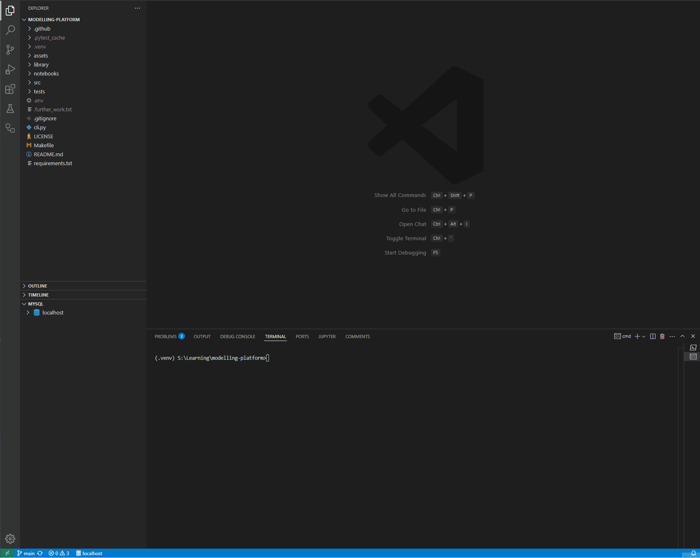

# stock-platform

[](https://github.com/blueskycircle/modelling-platform/actions/workflows/main.yml)

**Description:**

The stock-platform project is a Python-based application designed for fetching, storing, analyzing, and visualizing stock market data. It provides a command-line interface (CLI) for easy interaction and supports various analytical tools to gain insights into stock performance. The platform leverages the Alpha Vantage API for data ingestion and a MySQL database for persistent storage. Key features include automated data updates, comprehensive data analysis, and customizable visualizations.

## Table of Contents

- [Data Ingestion](#data-ingestion)
  - [Prerequisites](#prerequisites)
  - [Configuration](#configuration)
  - [Installation](#installation)
  - [Usage](#usage)
    - [Command Line Interface](#command-line-interface)
    - [Options](#options)
  - [Database Schema](#database-schema)
  - [Features](#features)
  - [Example Usage](#example-usage)
  - [Error Handling](#error-handling)
- [Data Analysis](#data-analysis)
  - [List Available Symbols](#list-available-symbols)
  - [Price History Chart](#price-history-chart)
  - [Performance Dashboard](#performance-dashboard)
  - [Returns Analysis](#returns-analysis)
- [Forecasting](#forecasting)
  - [Arguments](#arguments)
  - [Options](#options-1)
  - [Detailed Explanation](#detailed-explanation)
    - [Single Model Forecasting](#single-model-forecasting)
    - [Model Evaluation](#model-evaluation)
  - [Examples](#examples)
    - [1. Basic ARIMA Forecast with Default Settings](#1-basic-arima-forecast-with-default-settings)
    - [2. Specify Different ARIMA Model Parameters](#2-specify-different-arima-model-parameters)
    - [3. Custom Date Range](#3-custom-date-range)
    - [4. Increase Forecast Period and Sample Size](#4-increase-forecast-period-and-sample-size)
    - [5. Save Parameter Trace Plots](#5-save-parameter-trace-plots)
    - [6. Evaluate Multiple ARIMA Models](#6-evaluate-multiple-arima-models)
    - [7. Evaluate Custom Set of ARIMA Models](#7-evaluate-custom-set-of-arima-models)
    - [8. Complete Example with Custom Naming](#8-complete-example-with-custom-naming)
    - [9. Model Selection with Custom Settings](#9-model-selection-with-custom-settings)
  - [Additional Notes](#additional-notes)

## Data Ingestion

The data ingestion module provides functionality to fetch and store financial market data from Alpha Vantage API into a MySQL database. It supports incremental updates and handles multiple stock symbols.




### Prerequisites

- Python 3.11+
- MySQL Server
- Alpha Vantage API key

### Configuration

Create a `.env` file in the project root with the following variables:

```plaintext
ALPHA_VANTAGE_API_KEY=your_api_key
DB_HOST=localhost
DB_USER=your_db_user
DB_PASSWORD=your_db_password
DB_NAME=your_database_name
```

### Installation

```cmd
pip install -r requirements.txt
```

### Usage

#### Command Line Interface

1. Fetch data for one or more symbols:
```cmd
python cli.py fetch AAPL GOOGL
```

2. View stored data for a symbol:
```cmd
python cli.py show AAPL --limit 10
```

#### Options

- `fetch` command:
  - `-t, --table-name`: Specify custom table name (default: "stock_prices")

- `show` command:
  - `-t, --table-name`: Specify table to query (default: "stock_prices")
  - `-l, --limit`: Number of records to display (default: 5)

### Database Schema

The data is stored in a MySQL table with the following structure:

```sql
CREATE TABLE stock_prices (
    date DATE NOT NULL,
    open DECIMAL(10,2) NOT NULL,
    high DECIMAL(10,2) NOT NULL,
    low DECIMAL(10,2) NOT NULL,
    close DECIMAL(10,2) NOT NULL,
    volume BIGINT NOT NULL,
    symbol VARCHAR(10) NOT NULL,
    PRIMARY KEY (date, symbol)
)
```

### Features

- Automatic database and table creation
- Incremental updates (only fetches new data)
- Error handling and logging
- Rate limit compliance for API requests
- Support for multiple stock symbols
- Data validation and type conversion

### Example Usage

1. Initial data fetch:
```cmd
python cli.py fetch AAPL
> Successfully processed data for symbols: AAPL
```

2. View the latest data:
```cmd
python cli.py show AAPL --limit 3
> Latest 3 records for AAPL:
--------------------------------------------------------------------------------
Date         Open      High      Low       Close     Volume      
--------------------------------------------------------------------------------
2024-02-24   100.00   101.00    99.00     100.50   1000000     
2024-02-23   99.00    100.00    98.00     99.50    900000      
2024-02-22   98.50    99.50     98.00     99.00    850000      
```

3. Fetch multiple symbols:
```cmd
python cli.py fetch AAPL GOOGL
> Successfully processed data for symbols: AAPL, GOOGL
```

3. Using SQL directly:

First you will need to log in

```cmd
mysql --user=your_db_user --password=your_db_password
```

You can now run SQL commands

```sql
SELECT * FROM modelling_platform.stock_prices WHERE symbol = 'AAPL' LIMIT 10;
SELECT * FROM modelling_platform.stock_prices WHERE symbol = 'GOOGL' AND volume > 75000000;
```

### Error Handling

The system handles various error scenarios:
- Invalid API responses
- Network connectivity issues
- Database connection problems
- Missing or invalid data
- Rate limiting

All errors are logged with appropriate messages for troubleshooting.

## Data Analysis

The data analysis module provides comprehensive tools for analyzing and visualizing stock market data. The analysis tools are accessible through the command line interface:

### List Available Symbols


```cmd
python cli.py list-symbols
```

### Price History Chart

Generate a price history chart with moving averages:

```cmd
python cli.py price-history SYMBOL [OPTIONS]
```

Options:

- `-s, --start-date`: Start date in YYYY-MM-DD format
- `e, --end-date`: End date in YYYY-MM-DD format
- `-o, --output`: Output file path (default: "price_history.png")
- `--volume/--no-volume`: Include/exclude volume subplot (default: include)

Example:



```cmd
python cli.py price-history AAPL -s 2023-01-01 -e 2024-01-01 -o .output/apple_price.png
```

### Performance Dashboard

Generate a comprehensive dashboard with price history, volume, daily returns, and key metrics:

```cmd
python cli.py dashboard SYMBOL [OPTIONS]
```

Options:

- `-s, --start-date`: Start date in YYYY-MM-DD format
- `e, --end-date`: End date in YYYY-MM-DD format
- `-o, --output`: Output file path (default: "dashboard.png")

Example:



```cmd
python cli.py dashboard GOOG -s 2023-01-01 -o .output/goog.png
```

### Returns Analysis

Analyze the distribution of stock returns:

Options:

```cmd
python cli.py returns SYMBOL [OPTIONS]
```

- `-s, --start-date`: Start date in YYYY-MM-DD format
- `-e, --end-date`: End date in YYYY-MM-DD format
- `-p, --period`: Period for return calculation ["daily", "weekly", "monthly"] (default: "daily")
- `-o, --output`: Output file path (default: "returns.png")

Example:


```cmd
python cli.py returns GOOG -s 2023-01-01 -p daily -o .output/google_returns.png
```

## Forecasting

The forecasting module provides tools for predicting future stock prices using ARIMA models. The `forecast-arima` command offers both single-model forecasting and model evaluation capabilities.



```cmd
python cli.py forecast-arima SYMBOL [OPTIONS]
```

### Arguments

-   `SYMBOL`: The stock symbol to forecast (e.g., AAPL, GOOG).

### Options

-   `-s, --start-date`: Start date for historical data in YYYY-MM-DD format (default: 2 years ago).
-   `-e, --end-date`: End date for historical data in YYYY-MM-DD format (default: today).
-   `-p`: AR order parameter (default: 1).
-   `-d`: Differencing order parameter (default: 0).
-   `-q`: MA order parameter (default: 0).
-   `-f, --forecast-days`: Number of days to forecast (default: 30).
-   `-n, --samples`: Number of MCMC samples for Stan (default: 1000).
-   `-o, --output`: Output file path for the forecast chart (default: "arima_forecast.png").
-   `--save-params`: Flag to save parameter trace plots.
-   `-po, --params-output`: Output file path for parameter plots (default: "arima_params.png").
-   `--save-results`: Flag to save forecast results to the database.
-   `--evaluate / --no-evaluate`: Evaluate multiple ARIMA models to find the best fit (default: False).
-   `--models, -m`: ARIMA models to evaluate, format: 'p,d,q;p,d,q' (e.g., '1,0,0;1,1,1;2,1,0').

### Detailed Explanation

The `forecast-arima` command allows you to generate stock price forecasts using ARIMA (Autoregressive Integrated Moving Average) models. You can either specify the ARIMA parameters directly or use the `--evaluate` option to have the system test multiple models and select the best one.

#### Single Model Forecasting

When you specify the ARIMA parameters (`-p`, `-d`, `-q`), the command fits a single ARIMA model to the historical data and generates a forecast.

#### Model Evaluation

When you use the `--evaluate` option, the command tests multiple ARIMA models and selects the best one based on performance metrics. Model evaluation generates three plots:
- Main forecast plot showing the best model's predictions
- Metrics comparison plot showing RMSE and other metrics for each model
- Forecast comparison plot showing predictions from all evaluated models

You can specify which models to evaluate using the `--models` option, or the system will use a default set of models.

### Examples

#### 1. Basic ARIMA Forecast with Default Settings

```cmd
python cli.py forecast-arima AAPL
```

This command runs an ARIMA(1,0,0) model on Apple stock with:

*   Default 2 years of historical data
*   30-day forecast
*   1000 MCMC samples
*   Saves the forecast chart as "arima_forecast.png"

#### 2. Specify Different ARIMA Model Parameters

```cmd
python cli.py forecast-arima MSFT -p 2 -d 1 -q 1
```

This command runs an ARIMA(2,1,1) model on Microsoft stock, which:

*   Uses 2 AR terms
*   First-differences the data
*   Includes 1 MA term

#### 3. Custom Date Range

```cmd
python cli.py forecast-arima TSLA -s 2022-01-01 -e 2023-12-31
```

This command forecasts Tesla stock using:

*   Historical data from Jan 1, 2022, to Dec 31, 2023
*   Default ARIMA(1,0,0) parameters

#### 4. Increase Forecast Period and Sample Size

```cmd
python cli.py forecast-arima GOOGL -f 60 -n 2000
```

This command runs a forecast for Google with:

*   60-day forecast horizon (instead of the default 30)
*   2000 MCMC samples for more precise posterior estimates

#### 5. Save Parameter Trace Plots

```cmd
python cli.py forecast-arima AMZN --save-params -po amazon_params.png
```

This command saves:

*   Standard forecast chart as "arima_forecast.png"
*   Parameter trace plots as "amazon_params.png"

#### 6. Evaluate Multiple ARIMA Models

```cmd
python cli.py forecast-arima NFLX --evaluate
```

This command:

*   Tests multiple default ARIMA configurations
*   Selects the best model based on error metrics
*   Generates forecast using the winning model
*   Produces comparison plots of all models tested

#### 7. Evaluate Custom Set of ARIMA Models

```cmd
python cli.py forecast-arima META --evaluate -m "1,0,0;0,1,1;2,1,1"
```

This command:

*   Tests only the three specified ARIMA configurations
*   Allows targeted evaluation of specific models
*   Useful when you have prior knowledge about which models might work well

#### 8. Complete Example with Custom Naming

```cmd
python cli.py forecast-arima AAPL -p 1 -d 0 -q 1 -s 2023-01-01 -e 2024-03-01 -f 45 -n 2000 -o .output/appl_forecast.png --save-params -po .output/appl_params.png --save-results
```

This comprehensive example:

*   Uses an ARIMA(1,0,1) model on Apple stock
*   Starts with data from Jan 1, 2023
*   Forecasts 45 days ahead
*   Uses 2000 MCMC samples
*   Saves forecast chart as ".output/appl_forecast.png"
*   Saves parameter plots as ".output/appl_params.png"
*   Stores forecast results in the database

#### 9. Model Selection with Custom Settings

```cmd
python cli.py forecast-arima MSFT --evaluate -m "1,0,0;1,1,0" -s 2023-01-01 -o .output/microsoft_best_model.png
```

This command evaluates models on more recent data and saves the best model forecast.