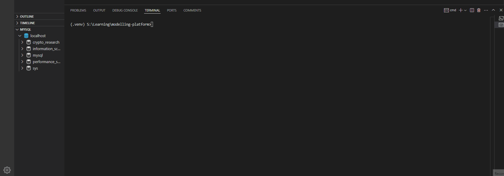

# modelling-platform

[](https://github.com/blueskycircle/modelling-platform/actions/workflows/main.yml)

## Data Ingestion

The data ingestion module provides functionality to fetch and store financial market data from Alpha Vantage API into a MySQL database. It supports incremental updates and handles multiple stock symbols.




### Prerequisites

- Python 3.11+
- MySQL Server
- Alpha Vantage API key

### Configuration

Create a `.env` file in the project root with the following variables:

```plaintext
ALPHA_VANTAGE_API_KEY=your_api_key
DB_HOST=localhost
DB_USER=your_db_user
DB_PASSWORD=your_db_password
DB_NAME=your_database_name
```

### Installation

```cmd
pip install -r requirements.txt
```

### Usage

#### Command Line Interface

1. Fetch data for one or more symbols:
```cmd
python cli.py fetch AAPL GOOGL
```

2. View stored data for a symbol:
```cmd
python cli.py show AAPL --limit 10
```

#### Options

- `fetch` command:
  - `-t, --table-name`: Specify custom table name (default: "stock_prices")

- `show` command:
  - `-t, --table-name`: Specify table to query (default: "stock_prices")
  - `-l, --limit`: Number of records to display (default: 5)

### Database Schema

The data is stored in a MySQL table with the following structure:

```sql
CREATE TABLE stock_prices (
    date DATE NOT NULL,
    open DECIMAL(10,2) NOT NULL,
    high DECIMAL(10,2) NOT NULL,
    low DECIMAL(10,2) NOT NULL,
    close DECIMAL(10,2) NOT NULL,
    volume BIGINT NOT NULL,
    symbol VARCHAR(10) NOT NULL,
    PRIMARY KEY (date, symbol)
)
```

### Features

- Automatic database and table creation
- Incremental updates (only fetches new data)
- Error handling and logging
- Rate limit compliance for API requests
- Support for multiple stock symbols
- Data validation and type conversion

### Example Usage

1. Initial data fetch:
```cmd
python cli.py fetch AAPL
> Successfully processed data for symbols: AAPL
```

2. View the latest data:
```cmd
python cli.py show AAPL --limit 3
> Latest 3 records for AAPL:
--------------------------------------------------------------------------------
Date         Open      High      Low       Close     Volume      
--------------------------------------------------------------------------------
2024-02-24   100.00   101.00    99.00     100.50   1000000     
2024-02-23   99.00    100.00    98.00     99.50    900000      
2024-02-22   98.50    99.50     98.00     99.00    850000      
```

3. Fetch multiple symbols:
```cmd
python cli.py fetch AAPL GOOGL
> Successfully processed data for symbols: AAPL, GOOGL
```

3. Using SQL directly:
```cmd
mysql --user=your-user-name --password=your-password
SELECT * FROM modelling_platform.stock_prices WHERE symbol = 'AAPL' LIMIT 10;
SELECT * FROM modelling_platform.stock_prices WHERE symbol = 'GOOGL' AND volume > 75000000;
```

### Error Handling

The system handles various error scenarios:
- Invalid API responses
- Network connectivity issues
- Database connection problems
- Missing or invalid data
- Rate limiting

All errors are logged with appropriate messages for troubleshooting.
